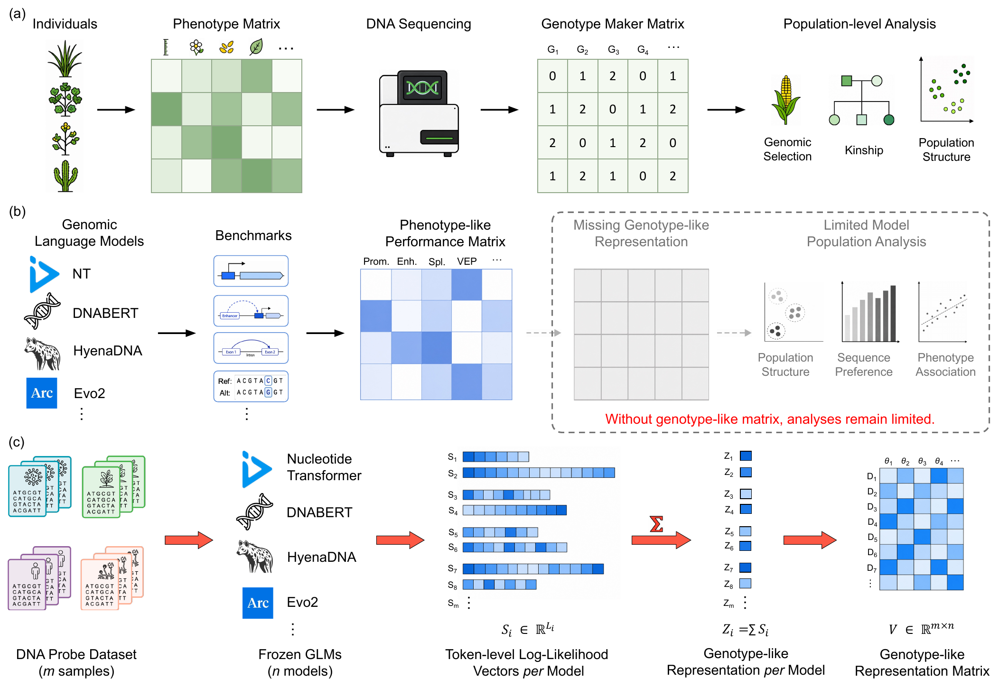
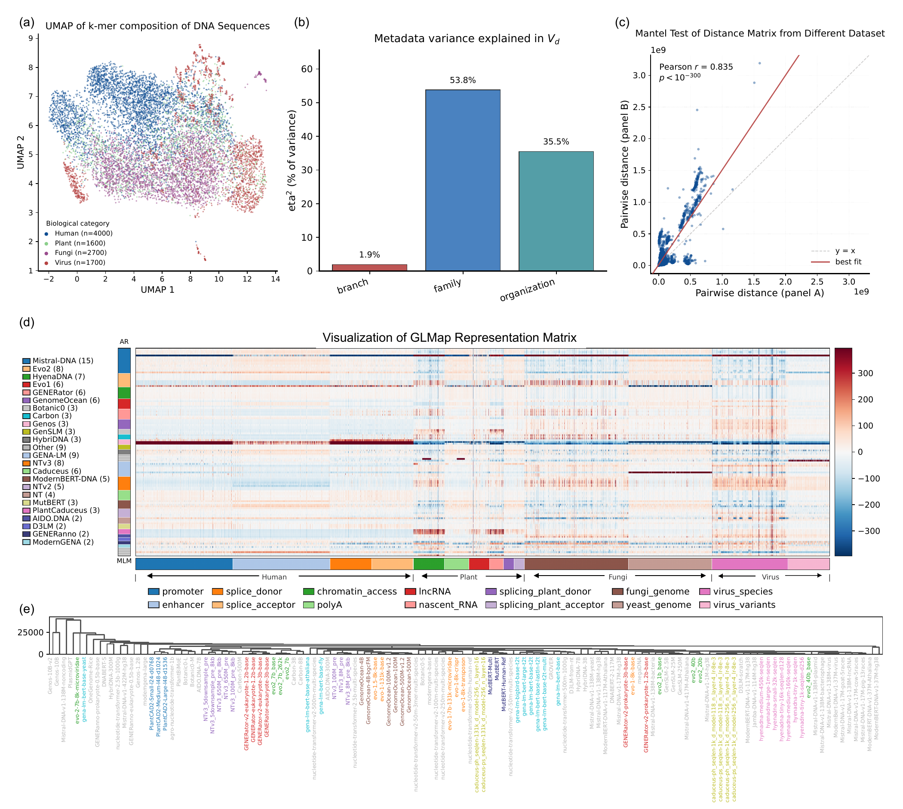
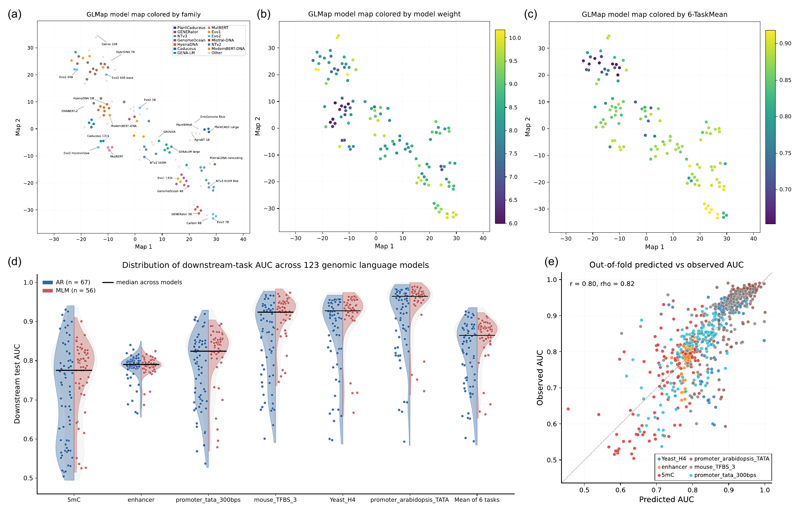

# GLMap

**Profiling genomic language models as individuals in a population.**

> 🚧 **Code is under construction...** The full release (`ai4nucleome-glmap >= 1.0.0`)
> accompanying the paper is in active preparation. The PyPI name has been
> reserved at <https://pypi.org/project/ai4nucleome-glmap/>. Watch this repository
> for updates. We will release full code to reproduce our study **before May 28, 2026** 🚧.

---

## What is GLMap?

A large and rapidly growing number of genomic language models (GLMs) have been
pre-trained on DNA, differing widely in architecture, training paradigm, and
training data. Comparing these models is typically done through downstream
benchmarks, which capture only task-level behavior and depend on labeled data
and fine-tuning. There is no task-independent way to characterize how GLMs
relate to one another, in part because their heterogeneous architectures and
tokenizers make their internal representations difficult to align.

**GLMap** is a training-free and architecture-agnostic framework for
representing models by their likelihood responses over a fixed panel of DNA
sequences. Applied to **123 publicly available GLMs** scored on a panel of
**10,000 DNA probes**, GLMap places autoregressive (AR) and masked-language
(MLM) models in a common space, yields model distances that are stable to the
choice of probes, and reflects known relationships among models.

<p align="center">
  
</p>

> **Figure 1. Overview of GLMap.**
> **(a)** In population genetics, a population of individuals is first
> described by a phenotype matrix, but sequencing yields a genotype marker
> matrix that supports population-level analyses.
> **(b)** GLMs are currently in an analogous but incomplete state: benchmarks
> summarize each model as a phenotype-like performance matrix, but no
> counterpart to the genotype matrix exists.
> **(c)** A fixed panel of *m* DNA probe sequences is scored by each of
> *n* frozen GLMs, producing a likelihood response matrix that serves as a
> genotype-like representation for each model.

---

## Highlights

- 🧬 **Train-free, label-free, architecture-agnostic.** Probes any GLM that
  exposes a token-level log-probability head, including both AR (`log p(x)`)
  and MLM (pseudo-log-likelihood) families.
- 🌍 **123 models on a common scale.** Covers
  Nucleotide Transformer, DNABERT-2, HyenaDNA, Caduceus, Evo-1/Evo-2, GenSLM,
  GENERator, GenomeOcean, PlantCAD2, AgroNT, and more — spanning 471K to 40B
  parameters across single-nucleotide, *k*-mer, and BPE tokenizers.
- 📐 **A single coordinate system (V_d).** A clip + double-center pipeline
  (following the *ModelMap* convention) absorbs per-model and per-probe
  biases, so AR and MLM models become directly comparable. The AR/MLM branch
  label explains only **1.9%** of variance in *V_d* vs **53.8%** for model
  family.
- 🛡️ **Robust to probe choice.** Element-disjoint split-half distance
  matrices correlate at **Mantel *r* = 0.835**, so the geometry doesn't
  depend on which functional elements are in the panel.
- 🎯 **Predicts downstream performance.** *V_d* signatures predict mean AUC
  across six binary tasks with **Spearman ρ = 0.705** (random *K*-fold).

---

## The model representation

After scoring all 123 GLMs on the 10,000-probe panel, the resulting GLMap
representation matrix *V_d* exhibits coherent block structure by model family and by functional element, and the split-half distance
geometry is stable across element-disjoint probe partitions.

<p align="center">
  
</p>

> **Figure 2. The GLMap probe panel and the resulting model representation.**
> **(a)** UMAP of the *k*-mer composition of all 10,000 probe sequences,
> colored by biological category.
> **(b)** Variance in *V_d* explained by three model metadata labels (η²).
> Branch (AR/MLM) explains only 1.9% — far less than model family (53.8%).
> **(c)** Mantel test on model-to-model distances computed independently on
> two element-disjoint halves of the panel; *r* = 0.835 indicates that the
> distance structure does not depend on the specific probe subset.
> **(d)** The GLMap representation matrix across all 123 models. Rows are
> models (grouped by family); columns are probes (grouped by functional
> element and biological category).
> **(e)** Hierarchical clustering of models based on *V_d* distances.

---

## Mapping the model population

Embedding *V_d* into two dimensions yields a model map in which nearby models
have similar likelihood responses. Models cluster by **family** (a), by
**scale** (b, log₁₀ parameter count), and by **downstream performance**
(c, mean AUC across six tasks). The *V_d* signature also **predicts
downstream task AUC** under random *K*-fold cross-validation (e, mean
across six tasks: Pearson *r* = 0.681, Spearman ρ = 0.705).

<p align="center">
  
</p>

> **Figure 3. *t*-SNE visualization of GLMap and prediction of downstream
> performance.**
> **(a-c)** Two-dimensional GLMap model map of the 123 models, colored by
> (a) family, (b) log₁₀ parameter count, (c) mean AUC across six downstream
> tasks.
> **(d)** Distribution of downstream test AUC across the 123 models for each
> of six tasks (and their mean), split by AR / MLM with the median across
> models marked.
> **(e)** Out-of-fold predicted vs observed AUC, where the predicted AUC is
> obtained from *V_d* signatures, colored by task. The diagonal marks perfect
> agreement.

---

## Status

| Component | Status |
|---|---|
| Paper | Coming soon... |
| PyPI name reserved | ✅ `ai4nucleome-glmap` v0.0.1 (placeholder) |
| Code release | 🚧 Forthcoming |
| Panel + matrices artefacts | 🚧 Forthcoming |
| Reproducibility scripts | 🚧 Forthcoming |

We expect to push the full v1.0.0 release within a few weeks of paper
submission. To be notified, watch / star this repository.

---

## Citation

If you wish to cite GLMap before the v1.0.0 release, please cite the preprint:

```bibtex
@article{hou2026glmap,
  title   = {Profiling genomic language models as individuals in a population},
  author  = {Hou, Yusen and Long, Weicai and Su, Houcheng and Feng, Junning and Zhang, Yanlin},
  journal = {In submission},
  year    = {2026}
}
```

A DOI will be added once the paper is accepted.

---

## License

Apache-2.0. See [LICENSE](LICENSE).

---

## Acknowledgements ❤️

GLMap builds on the ideas and infrastructure of several outstanding open-source
projects, without which this work would not have been possible:

- **[ModelMap](https://github.com/shimo-lab/modelmap)** 
- **[DNA Foundation Benchmark](https://github.com/ChongWuLab/dna_foundation_benchmark)**

We also thank the authors and maintainers of the **123 genomic language models**
audited in this work for releasing their weights and code publicly, making this
kind of population-scale comparison possible at all.

---

## Contact

- **Yusen Hou** — &lt;yhou925@connect.hkust-gz.edu.cn&gt; Data Science and Analytics Thrust, HKUST(GZ).
- **Corresponding author**: Yanlin Zhang &lt;yanlinzhang@hkust-gz.edu.cn&gt;.

For questions about the methodology, please open an issue on this repository
(once it is public). For collaboration enquiries, plz contact Yusen Hou directly.
