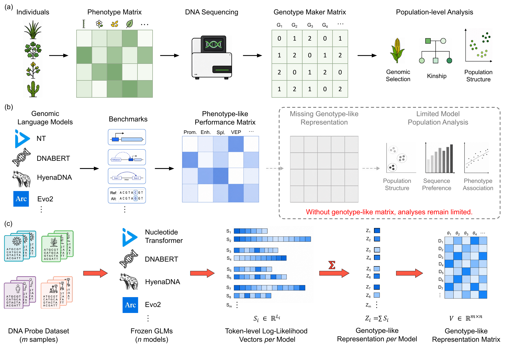
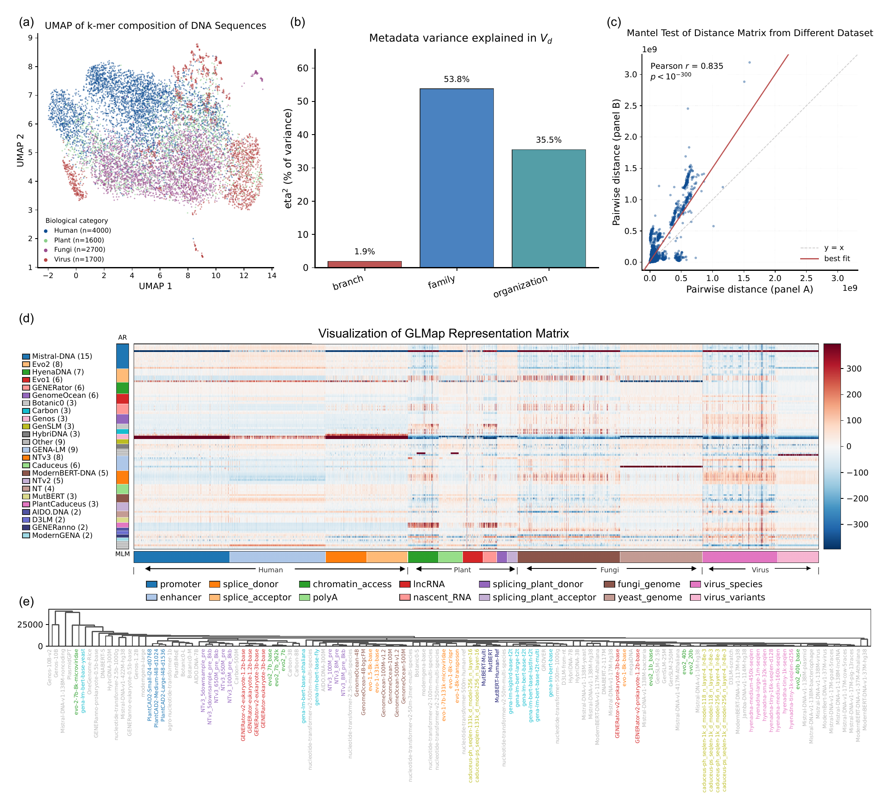
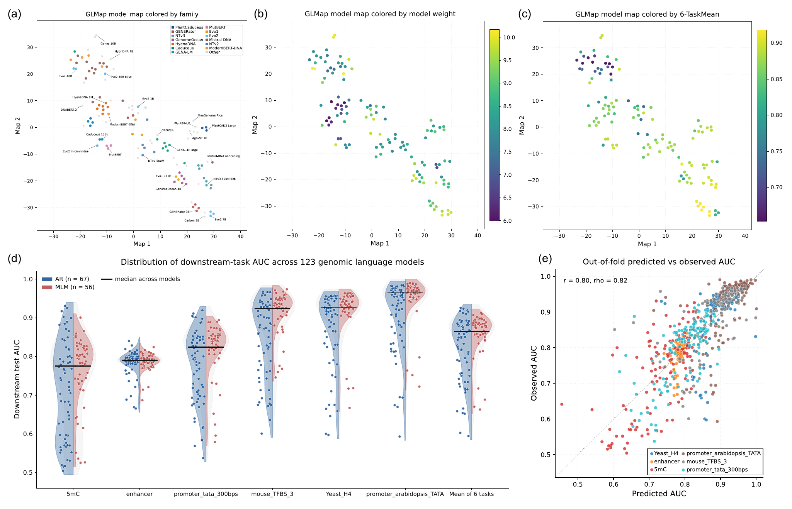

# 🧬 🗺️ GLMap: Profiling genomic language models as individuals in a population

> 🌐 Language: [中文](README.zh.md) · **English**
> 
> 📖 **Project page: [ai4nucleome.github.io/GLMap](https://ai4nucleome.github.io/GLMap/)**

<p align="center">
  
</p>

GLMap is a training-free, architecture-agnostic framework for representing and comparing genomic language models (GLMs) by their likelihood responses over a fixed panel of DNA sequences. Applied to **123 publicly available GLMs** scored on a panel of **10,000 DNA probes**, GLMap places autoregressive (AR) and masked-language (MLM) models in a common space, yields model distances that are stable to the choice of probes, and reflects known relationships among models.

---

## Installation

### Reproduce the paper's analysis from precomputed results

If you only want to **reproduce all of the paper's figures/tables** rather than
recompute the GLMap representations of the 123 models from scratch, the install
below is all you need. **No GPU, no model weights, no scoring.**
We recommend **Python 3.11.9**; the exact versions of the analysis-stack pip
packages are pinned in [`pyproject.toml`](pyproject.toml).

```bash
git clone https://github.com/ai4nucleome/GLMap.git
cd GLMap
pip install -e .
```

> **Note:** this install pulls in neither `torch` nor `transformers` (no GPU
> packages); it is enough for analysis and figures.

### Recomputing the 123-model scores

The 123 models span many **mutually incompatible runtime environments**
(different Python / PyTorch / CUDA versions per model family). We are
**packaging these environments into container images** so that recomputing the
likelihood responses for any model will be straightforward.

**Coming soon.**

---

## Quickstart: use precomputed GLMap artefacts

All precomputed artefacts for the paper's 123 models ship with the source
repository. No GPU, no model download, no scoring required.

```python
import glmap

# Two ways load_panel finds the 10,000-probe panel (on disk:
# data/panels/main_panel.parquet):
# - read it locally, or
# - auto-download it from HuggingFace (Tim419/GLMap-panels).
panel = glmap.load_panel()       # (10000, 11) DataFrame

# Or build and load your own panel
# panel = glmap.load_panel(path="my_panel.parquet")

# Load precomputed matrices by registered name ("V_AR") or by path.
V_AR  = glmap.load_matrix("results/scores/matrices/V_AR.npy")    # (64, 10000)  raw AR responses   (MLM: 59 models)
Vd_AR = glmap.load_matrix("results/scores/matrices/V_d_AR.npy")   # (64, 10000)  double-centered
D_AR  = glmap.load_matrix("results/scores/matrices/D_AR.npy")    # (64, 64)     pairwise model distances

# Re-run the matrix pipeline from raw scores
info = glmap.fit_matrix(V_AR, clip_q=0.02)

# Project a new model into the existing Vd space
Vd_new = glmap.project(new_model_scores, info)

# Load the 123-model audit metadata
audit = glmap.load_audit()       # list of 123 dicts
specs = glmap.specs_from_audit() # list of 123 ModelSpec objects
```

> The panel is published as a HuggingFace Dataset at
> [`Tim419/GLMap-panels`](https://huggingface.co/datasets/Tim419/GLMap-panels)
> (CC-BY-NC-SA-4.0).

---

## Repository layout

```
GLMap/
├── glmap/                  Python package
│   ├── loaders/            Per-family model loaders (HF, evo, genslm, ...) + dispatch
│   ├── scoring/            AR log-likelihood + MLM stride PLL
│   ├── matrices/           clip + double-center + pairwise distances
│   └── formats_check/      Embedding-parquet schema validation
├── scripts/                CLI entry points for paper reproduction
│   ├── panel_build/        Panel construction + panel_sources.yaml spec
│   ├── figures/            One script per paper figure
│   ├── tables/             One script per paper table
│   ├── audits/             Model audit script + context overrides
│   └── 0_*.sh … 7_*.sh     Numbered pipeline drivers (audit → … → model map)
├── data/
│   ├── audits/             123-model audit (models.json)
│   ├── downstream_tasks/   Downstream task metadata
│   └── panels/             Prebuilt probe panel parquets
├── results/
│   ├── scores/             Scoring outputs
│   │   ├── matrices/       V/V_d/D for AR and MLM branches
│   │   └── AR_MLM_scores/  Per-model likelihood responses (slimmed)
│   ├── analysis/           Downstream + secondary analysis outputs
│   │   ├── benchmark_perform_prediction/
│   │   │   ├── per_model_AUC_result_6tasks/  Per-model per-task AUC results
│   │   │   ├── all_model_AUC_6tasks/         Aggregated (123×6) AUC matrix
│   │   │   └── phenotype_prediction/         Predict downstream AUC from GLMap signatures
│   │   ├── model_map/      t-SNE / MDS embeddings for Fig 3
│   │   └── MLM_stride-PLL_vs_true-PLL_1000samples/  true PLL vs Stride PLL 消融(k=6, Fig S3)
│   ├── figures/            Paper figure PDFs
│   └── tables/             Paper table LaTeX sources
└── models/                 Model download manifest and setup scripts
```

---

## Pre-built artefacts included in this repository

Everything needed to reproduce the paper's analysis from precomputed results
ships with the repo — no model weights, no scoring required:

| Artefact |
|---|
| Probe panel (10,000 probes) |
| V/Vd/D matrices for AR + MLM |
| Per-model likelihood responses, slimmed |
| Downstream AUC results |
| Phenotype prediction outputs |
| t-SNE model map embeddings |
| Paper figures (23 PDFs) and tables (12 .tex) |

---

## The GLMap representation

<p align="center">
  
</p>

The GLMap representation matrix *V_d* exhibits coherent block structure by
model family, and the split-half distance geometry is stable across
element-disjoint probe partitions (Pearson *r* = 0.835 over model-pair
distances).

<p align="center">
  
</p>

The *V_d* representation predicts downstream task performance (mean AUC
Spearman ρ = 0.705 under random *K*-fold cross-validation).

---

## Acknowledgements

GLMap builds on the ideas and infrastructure of several outstanding
open-source projects:

- **[ModelMap](https://github.com/shimo-lab/modelmap)** (Oyama et al., ACL *2025*)
- **[DNA Foundation Benchmark](https://github.com/ChongWuLab/dna_foundation_benchmark)**
  (Feng et al., Nat. Comm. *2025*)

We also thank the authors and maintainers of the **123 genomic language
models** audited in this work for releasing their weights and code publicly.

---

## Citation

```bibtex
@article{hou2026glmap,
  title   = {Profiling genomic language models as individuals in a population},
  author  = {Hou, Yusen and Long, Weicai and Su, Houcheng and Feng, Junning and Zhang, Yanlin},
  journal = {In submission},
  year    = {2026}
}
```

---

## License

This repository uses **two licenses**:

- **Source code** (everything under `glmap/`, `scripts/`, `tests/`,
  etc.): [Apache-2.0](LICENSE).
- **Data artefacts** (`data/panels/`, `results/scores/matrices/`,
  `results/scores/AR_MLM_scores/`, `results/analysis/`): [CC-BY-NC-SA-4.0](LICENSE-DATA).
  These artefacts inherit the upstream Plant Genomic Benchmark license
  (1,600 probes drawn from PGB; CC-BY-NC-SA-4.0 via ShareAlike). They
  are usable for non-commercial research with attribution; commercial
  use requires obtaining the panel from a license-compatible source.

Individual model weights also follow their own upstream licenses (see
[models/README.md](models/README.md)).
